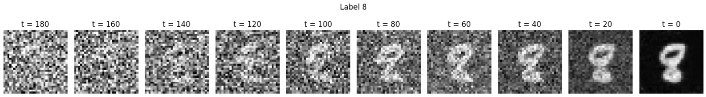
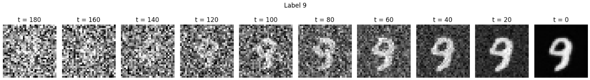

# 🧠 DDPM

_Diffusion Model for Image Generation_  

---

## 📝 Overview
- Implemented with Cosine noise schedule, UNet with Attention block for the backward process

---

## 🗂️ Repository Structure
- DDPM.ipynb contains the dataset import, the model definition and training 

--- 

## 📊 Results

  
  
*Samples generated by the DDPM model.*

